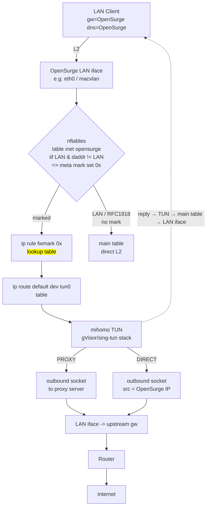

# QNAP Porting Audit

本文档是 OpenSurge for QNAP 派生开发的**前置架构审计**。目的是在动任何业务代码之前，把
upstream（OpenSurge for Mac）的代码分成四类，避免把 `pfctl` 全局替换成 `nft` 之后
继续把平台代码散落在 gateway manager 里。

- Upstream: <https://github.com/YTwsy/OpenSurge-for-Mac>
- Fork baseline: `b03bf2f8a2b02a6fffba9c879ce1980ddb831a67`（v0.2.2 merge，2026-09-07）
- 审计日期: 2026-09-09
- 规模: Go 约 43,400 行（含测试），前端 web/src 约 12,960 行，Swift menubar App 一个

分类约定：

| 类别 | 含义 |
| --- | --- |
| **A** | 完全跨平台，可直接保留 |
| **B** | 主体可复用，需要 Linux 适配 |
| **C** | macOS 专属，需要替换（有对等的 Linux 能力） |
| **D** | QNAP/Linux v1 直接删除或禁用 |

---

## 0. 审计结论摘要

upstream 已经具备一个**非常好的可移植底座**，这决定了本次改造应当是「抽象 + 迁移」而不是重写：

1. `internal/gateway/manager.go` 的依赖全部通过 `gatewayDeps` 结构体注入（`manager.go:91-159`）。
   `pfService` / `sysctlService` / `localSystemProxyService` / `ipv6HostService` 都是接口。
   **替换 macOS 后端不需要改 manager 主流程**，只需要换注入的实现。这是最重要的发现。
2. `internal/process` 已经实现了 PID + 进程指纹（`Fingerprint` 用 `ps` 输出做 sha256，
   `process.go:64/88`），且 `command.go` 全程 `exec.Command(name, args...)` **没有 `sh -c` 拼接**。
   需求第 37 条（禁止 shell 注入）在 upstream 已经基本满足，我们只需要守住这条底线。
3. `internal/runtime/boot_linux.go` **已经是真实的 Linux 实现**（读
   `/proc/sys/kernel/random/boot_id` + `/proc/stat` 的 `btime`），不是空 stub。
4. Web 端已经全部挂在 `/api/v1` 前缀（`server.go:259-327`），并且已经有统一的错误信封
   `{schema_version, error:{code,message}}`、session cookie（HttpOnly + SameSite=Strict）、
   Origin 校验式 CSRF 防护。需求第 31 条（API 版本化 + 统一错误码）的基础也在。

需要重点重写的是：**网络数据面（pf → nftables + policy routing）**、**认证（loopback → LAN 真实认证）**、
**运行时目录（macOS Application Support → /data 卷）**。

---

## A 类 — 完全跨平台，可直接保留

### A1. 领域模型与规则编译

| 路径 | 说明 |
| --- | --- |
| `internal/device/model.go` | 设备身份模型（IPv4 / MAC / 备注 / 策略），纯数据 |
| `internal/device/policy.go`（969 行） | 设备策略 → mihomo 规则编译，**纯业务逻辑，无平台调用** |
| `internal/device/resolution.go` | 设备到出口的解析 |
| `internal/device/bundle.go` | 策略 bundle，已带 `schema_version`（`bundle.go:21`） |
| `internal/device/policy_file.go` | 策略文件读写 |
| `internal/lan/lan.go` | CIDR / 广播 / 偏移的纯 `net` 运算 |

**判定：整包保留。** 这是 upstream 最有价值的资产之一，重写等于自杀。

### A2. mihomo 配置渲染与 profile 解析

| 路径 | 说明 |
| --- | --- |
| `internal/mihomo/config.go` | `text/template` 渲染 mihomo.yaml。TUN 段字段齐全：`enable/stack/device/auto-route/auto-detect-interface/strict-route/dns-hijack/route-address/route-exclude-address` |
| `internal/mihomo/profile.go` | 导入 profile 解析 + `gatewayOwnedDNSFields` 过滤 |
| `internal/mihomo/profile_overlay.go` | profile overlay（叠加自定义规则） |
| `internal/mihomo/api.go` | mihomo External Controller API 客户端 |
| `internal/config/render.go` / `validator.go` / `profile_digest.go` | 配置渲染、校验、digest |

**判定：保留，仅改默认值。** 模板本身平台无关；macOS 味道只在**默认值**里
（`TUNDevice` 默认 `utun123`、`PF.AnchorName` 默认 `com.apple/...`）。
`route-exclude-address` 已经把 `{{ .LANPrefix }}`、RFC1918、组播排除掉
（`config.go:71-80`），这个语义在 Linux 上完全正确，直接继承。

### A3. 控制面可复用业务逻辑

| 路径 | 说明 |
| --- | --- |
| `internal/controlapi/proxy_health.go` | 代理健康检查（只依赖 config + mihomo） |
| `internal/controlapi/connectivity.go` | 连通性测试（只依赖 config + mihomo） |
| `internal/controlapi/policy_workspace.go` | 策略工作区：候选校验 → 原子落盘 → reload |
| `internal/controlapi/doctor_controller.go` | doctor 的控制面封装 |
| `internal/controlapi/profile_overlay.go` / `sources.go` | 订阅源与 overlay 管理 |
| `internal/controlapi/operations.go` | 异步操作与进度上报 |
| `internal/controlapi/mihomo_recovery.go` | mihomo 恢复流程 |
| `internal/controlapi/connection_refresh.go` | 连接刷新 |
| `internal/controlapi/models.go`（大部分） | DTO |

`policy_workspace.go` 里已经用 `writeAtomic`（`store.go:325-345`：`os.CreateTemp` + `os.Rename`）
做原子配置写入，且**在写入前做候选校验**。需求第 16 条的基础已经存在，我们只需要把它
从「只有 policy workspace 用」提升为「全局唯一的写配置入口」，并补上 fsync 与历史备份。

### A4. 运行时状态与进程管理

| 路径 | 说明 |
| --- | --- |
| `internal/runtime/state.go` | `State` 结构 + `SaveState` 原子写（temp + chmod 0640 + rename） |
| `internal/runtime/boot.go` / `boot_linux.go` | BootSession（Linux 已实现） |
| `internal/runtime/lifecycle_lock.go` | 跨进程生命周期锁 |
| `internal/process/process.go` / `command.go` | 进程启动 / 存活 / 指纹 / 停止 |
| `internal/gateway/lifecycle_lock.go` / `progress.go` / `status.go` | 生命周期锁、进度、状态 |

**判定：保留。** 需求第 39 条（不要只靠 PID 文件，要记 fingerprint）upstream **已经做到了**。

---

## B 类 — 可复用，但需要 Linux 适配

### B1. `internal/sysctl/ipforward.go`

```go
const keyIPForwarding = "net.inet.ip.forwarding"   // ipforward.go:11
```

纯 macOS key。Linux 是 `net.ipv4.ip_forward`。单文件、无 `_darwin.go/_linux.go` 分文件。

**适配方案**：拆成 `ipforward_darwin.go` / `ipforward_linux.go`，Linux 侧写
`/proc/sys/net/ipv4/ip_forward`（比调 `sysctl` 二进制更可靠，且不需要 `sysctl` 存在）。
同时必须记录原值用于回滚——upstream 已经把 `IPForwardingBefore` 存进 `State`（`state.go:19`），
语义直接继承。

### B2. `internal/mihomo/config.go` 的 TUN 默认值与平台字段

- `TUNDevice` 默认 `utun123` → Linux 应默认 `tun0`（或 `opensurge0`）。
- `interface-name: {{ .UpstreamInterface }}`（`config.go:21`）：Linux 容器里上游口就是 LAN 口，
  语义保留，但取值来源要从 macOS 的 `networksetup` 改成 netlink/`/sys/class/net`。
- `dns-hijack: any:53`（`config.go:65-66`）：**必须与 dnsmasq 的 53 端口冲突问题一起决策**。
  见 §D5 与数据面设计。
- opensurge-packet IPv6 listener（`config.go:83-92`）依赖 macOS BPF broker → v1 删除（D 类）。

**适配方案**：模板保留，删除 IPv6 listener 段，`TUNDevice` 默认值改 Linux 语义。

### B3. `internal/dhcp/*`（dnsmasq）

`template.go` 用的是**标准跨平台 dnsmasq 语法**（`interface=` / `bind-interfaces` /
`dhcp-range` / `dhcp-option` / `pid-file` / `server=`），无 macOS 专属行为。

**需要适配的点**：
1. `resolveBinary`（`dnsmasq.go:84`）从 `cfg.DHCP.Binary` 或 PATH 找 `dnsmasq` —— 在容器里
   我们要改成固定路径 `/usr/sbin/dnsmasq`，并且**不从 PATH 猜**。
2. `bind-interfaces` 在容器里如果 LAN 口是 macvlan，dnsmasq 需要 `bind-dynamic` 或者
   等接口 up 后启动，否则会 "unknown interface"。启动顺序必须保证接口已 up。
3. dnsmasq 版本必须**镜像内固定**（upstream 用 `DNSMASQ_VERSION=2.93`，
   `scripts/prepare-gui-release-deps.sh:11`），不能 latest。

### B4. `internal/device/scanner.go` 与邻居发现

`scanner.go:13` 解析 dnsmasq lease 文件 —— 跨平台，保留。
但**邻居/ARP 发现**是 macOS 专属：

- `internal/gateway/reservation_conflicts.go:61` → `/usr/sbin/arp -n`
- `internal/controlapi/models.go:493` → macOS ARP 缓存

**适配方案**：Linux 改用 `ip neigh show`（或 netlink `NEIGH` 查询），保留 `device` 包不变。

### B5. `internal/controlapi/network_defaults.go`

算法（从接口信息算 DHCP 池）可复用，但入参是 `macosnetwork.Snapshot` → 改为平台抽象层的
`NetworkInterface`。

### B6. `internal/mihomo/tailscale*.go` + `internal/controlapi/tailscale*.go`

Tailscale 本身跨平台，是可选集成不是核心。但：
- 探测路径写死 macOS（`/Applications/Tailscale.app/...`，`tailscale_discovery.go:212`）
- 路由探测依赖 `macosnetwork.RouteSelection`

**判定：v1 保留但禁用（`Tailscale.Enabled` 默认 false），discovery 路径改 Linux。** 不在 v1
投入测试资源。

---

## C 类 — macOS 专属，需要替换

### C1. `internal/pf/`（pfctl）→ nftables

`internal/pf/template.go:10-16` 生成的 anchor 只有两条语义：

```
nat on <if> from <LanCIDR> to any -> (<if>)
pass in/out all
```

**注意：pf 里没有 rdr/redirect。** 透明代理完全靠 mihomo TUN，pf 只做 SNAT。
这一点极大简化了 Linux 侧的实现——我们也不需要 TPROXY/REDIRECT。

替换目标：`internal/platform/linux/nftables.go`，只维护 `table inet opensurge`。

### C2. `internal/macosnetwork/`（networksetup / route / arp / netstat）

| 文件 | macOS 命令 | Linux 替代 |
| --- | --- | --- |
| `network.go`（74/113/176/187/201/291） | `networksetup` | netlink / `/sys/class/net` |
| `tun_routes.go:17` | `/sbin/route` | `ip route` / netlink |
| `neighbors.go:24` | `/usr/sbin/arp` | `ip neigh` / netlink |
| `system_proxy.go:103` | `networksetup -setwebproxy` | **无对应（容器内无系统代理概念）→ no-op** |
| `manager.go:65/89` | `/usr/sbin/netstat` | `/proc/net/*` |

**整包替换为 `internal/platform/linux/`。**

### C3. `internal/macosipv6/` + `internal/ipv6packet/bpf_darwin.go`

- `ra_darwin.go`：发 ICMPv6 RA 做 IPv6 网关撤回
- `bpf_darwin.go`：BPF 抓 IPv6 入站帧（upstream 的核心 IPv6 透明代理机制）
- `bpf_other.go` / `ra_other.go`：非 Darwin 直接报错

**判定：Linux 无对等能力（BPF 是 macOS 的 `/dev/bpf` 语义），v1 删除。** 符合需求第 28 条
（IPv6 downstream takeover 第一版不支持，但要留边界并明确提示）。

### C4. `internal/controlapi/sleep_prevention.go`

`pmset -a disablesleep`（`sleep_prevention.go:18,220`）——防 Mac 合盖休眠。
NAS 没有这个语义 → **D 类删除**。`sleep_prevention_helper.go` 的 lease 文件管理逻辑可留作
参考但 v1 不需要。

### C5. 默认监听地址与存储目录

- `server.go:110-116`：`New()` **强制** host 只能是 `127.0.0.1`/`localhost`，
  `securityHeaders`（`442-458`）还拒绝非 loopback 的 Host。
- `store.go:122`：默认 `StoreDir` 是 `~/Library/Application Support/OpenSurge`
- `server.go` 里 `HelperClient` socket 是 `/var/run/opensurge/helper.sock`（macOS 特权助手）

**替换**：监听 `0.0.0.0:<port>`，存储目录改 `/data/*`，删掉 Helper（容器里我们本来就是 root）。

### C6. 认证模型

upstream 的认证是「本地单机」假设：

- 无用户名密码（**需求第 13 条明确要求改**）
- Bearer token 写文件 `control-token`（0600），`server.go:128/463`
- session cookie `opensurge_session`
- 一次性 bootstrap code：`GET /bootstrap?code=` + `POST /api/v1/session/bootstrap`，30s 过期

**替换**：首次启动 setup wizard → Argon2id 密码 → HttpOnly/SameSite/CSRF session →
登录限流 → 审计日志。token+session 的**骨架**可保留，认证**强度**必须重建。

### C7. `internal/process/process.go` 的 `ps` 参数

`Fingerprint` 用 `/bin/ps -ww -p PID -o lstart=,command=`（`process.go:64`）。
`-ww` 是 BSD 宽输出旗标，Linux procps-ng 建议用 `-w`（重复 `-ww` 在 Linux 上也能接受，
但 `lstart` 输出格式不同）。因为它只用于**哈希做指纹**，格式差异无副作用；
但更稳妥的是 Linux 侧直接读 `/proc/<pid>/stat` + `/proc/<pid>/cmdline`。

**适配方案**：platform 化 `Fingerprint`，Linux 走 `/proc`，不依赖 `ps`。

---

## D 类 — QNAP/Linux v1 直接删除或禁用

### D1. macOS App 与打包（整目录删除）

| 路径 | 理由 |
| --- | --- |
| `apps/menubar/`（整个 Swift 工程，13 个源文件 + 测试） | macOS 菜单栏 App |
| `packaging/launchd/*.plist` | LaunchDaemon（`RunAtLoad` + `KeepAlive`） |
| `packaging/pkg-scripts/{preinstall,postinstall,installed-processes.sh,recovery-state.sh}` | PKG 安装脚本 |
| `packaging/gui-components.plist` | 安装器组件清单 |
| `packaging/unsigned-release-notes.md` | macOS 未签名发布说明 |
| `scripts/build-gui-installer.sh` / `notarize-gui-installer.sh` / `verify-unsigned-gui-installer.sh` | PKG 打包与公证 |
| `scripts/build-menubar-app.sh` / `check-menubar.sh` / `check-gui-packaging.sh` / `uninstall-gui.sh` | menubar App 构建与卸载 |
| `scripts/prepare-gui-release-deps.sh` | 拉 macOS 版 dnsmasq（改为在 Dockerfile 里编 Linux 版） |

**注意**：`cmd/opensurge-helper`（macOS 特权助手）与 `cmd/opensurge-install-config`
也要一并删除或改写。

### D2. macOS 专属模块

- `internal/macosipv6/`（整包）
- `internal/ipv6packet/` 的 `bpf_darwin.go` / `broker.go` / `manager.go`（v1 不启用 IPv6 接管）
- `internal/macosnetwork/system_proxy.go` 的本地系统代理（容器内 no-op 后删除）
- `internal/controlapi/sleep_prevention*.go`（pmset）
- `internal/runtime/boot_darwin.go`（保留文件但 build tag 隔离；Linux 构建天然排除）

### D3. macOS 实验室与真机测试

| 路径 | 理由 |
| --- | --- |
| `tests/lab/`（lima + socket_vmnet） | `install-host-deps.sh:11` 写死 `LIMA_Darwin`，`lab.sh` 全程 `limactl` |
| `tests/lab/host/io.opensurge.lab.socket-vmnet.plist` | macOS vmnet |
| `tests/lab/lima/*` | macOS VM 定义 |
| `tests/same-lan/smoke.sh`（176/1177 用 `ipconfig` / `scutil`） | macOS 客户端检查 |
| `tests/integration/egressprobe/dial_darwin.go` | `IP_BOUND_IF` 绑接口（macOS） |

**替换**：`tests/lab/` 改写为 Linux `ip netns` 三节点实验室（client → gateway → upstream），
即需求第 23 条的 `make lab-test-linux`。

### D4. Web UI 的 macOS 文案与组件

具体位置（来自前端审计）：

- `web/src/App.tsx:230` 品牌写死 `for Mac`；`App.tsx:243` "点击 macOS 菜单栏图标"
- `web/src/i18n.en.ts`：`This Mac`(151)、`This Mac only`(190)、`这台 Mac`(1231)、
  `菜单栏`(286/294/301/716)、`Finder 中显示`(344/383/414)
- `web/src/pages/NetworkPage.tsx`：`macOS HTTP/HTTPS 系统代理`(522)、`pf`(432/738)、
  `networksetup`(330/851)
- `web/src/components/TailscaleCard.tsx`（v1 隐藏）
- `SourcesPage` 的 "在 Finder 中显示"

**注意：不要重写 React UI。** 只做文案替换 + 新增 Dashboard/Network/Diagnostics 字段 +
删除菜单栏/pf/lid 相关组件。需求第 14 条明确要求「保留整体设计」。

### D5. 需要重新决策的一项：`dns-hijack` 与 dnsmasq 的 53 端口冲突

upstream 里 mihomo TUN 配了 `dns-hijack: any:53`（`mihomo/config.go:65-66`），
而 dnsmasq 又 `port=53`（`dhcp/template.go:41`）。在 macOS 上这不冲突，因为
mihomo 的 dns-hijack 作用在 **TUN 内部的包**上，dnsmasq 绑在**物理接口**上。

在 Linux 容器里同样不冲突（TUN 是独立设备），但我们要确认 mihomo 的
`auto-route` 不会顺手把宿主 53 端口也劫持了。**这正是我们决定
`auto-route: false`、由 OpenSurge 完全掌管路由的原因之一**（见数据面设计）。

---

## 四、数据面设计（v1）

### 4.1 为什么不沿用 upstream 的 pf 语义

upstream 的 pf 只做两件事：SNAT + 全通。透明代理靠 mihomo TUN。
Linux 上我们延续**同一个哲学**：nftables **只做标记（fwmark）**，真正的引流靠
policy routing，代理靠 mihomo TUN。**不引入 TPROXY，不引入 REDIRECT。**

### 4.2 选型的三个候选与取舍

| 方案 | 做法 | 结论 |
| --- | --- | --- |
| **A. TUN + fwmark 策略路由**（选定） | nftables 给 LAN 入站包打 mark，`ip rule fwmark → 独立路由表`，表里 `default dev tun0` | 单一机制、可审计、可回滚、与 mihomo 无重叠 |
| B. TUN + mihomo auto-route | 交给 mihomo 自己建路由/规则 | mihomo 会建自己的 nft/iptables 规则，与我们和 QNAP/Container Station 的规则**可能互相覆盖**，难以审计与回滚 |
| C. TPROXY | nftables tproxy 到 mihomo 的 tproxy-port | 与 TUN 机制重叠，违反需求第 5 条「不要混合」 |

**选定 A。关键决策：`tun.auto-route: false`，OpenSurge 100% 拥有宿主路由与 nftables。**

理由：
1. 可回滚——我们自己建的路由表/规则，我们自己删；不会残留 mihomo 建的匿名规则。
2. 不污染——mihomo 若用 auto-redirect 会动宿主的 nft/iptables，违反需求第 6 条。
3. DNS 不依赖 hijack——dnsmasq 已经在 53 上，mihomo DNS 在 `0.0.0.0:1053`
   （`mihomo/config.go:44`），dnsmasq `server=` 指过去（`dhcp/template.go:45-48`）。
   这条链路**与 TUN 完全解耦**，auto-route 关掉也不受影响。

### 4.3 数据路径



**对称性说明（重要）**：mihomo 在 TUN 里**终结 TCP/UDP 并从容器自身 IP 重新发起连接**，
所以回程必然回到 OpenSurge，再由 mihomo 写回 TUN、经 main 表走 LAN 口送达客户端。
路径天然对称，**不需要 MASQUERADE**（除非启用 Direct Fallback，见 §4.6）。

### 4.4 必须处理的 Linux 细节

1. **`rp_filter` 必须关**：否则内核会因反向路径校验丢弃 TUN 与 LAN 口之间的包。
   需要 `net.ipv4.conf.<iface>.rp_filter=0`（LAN 口、tun 口、all、default）。
2. **`net.ipv4.ip_forward=1`**：容器里改 `/proc/sys/net/ipv4/ip_forward` 需要
   `CAP_NET_ADMIN` + **sysfs 可写**。注意 Docker 默认把 `/proc/sys` 挂成只读，
   需要 `sysctls:` 或 privileged。这是**能力清单里必须说清楚的一项**（见 §5）。
3. **TUN 设备**：`/dev/net/tun` + `CAP_NET_ADMIN`。设备名由 mihomo 按 `tun.device` 创建，
   OpenSurge 需轮询等待其出现（有超时）。
4. **容器自身流量不得入 TUN**：我们的 nft 规则条件是 `iif <lan>`，本地发起的包不匹配；
   mihomo 自己的出口连接走 main 表 → 正常出网。无环路。

### 4.5 nftables 隔离（对应需求第 6 条）

```
table inet opensurge {
    chain prerouting { type filter hook prerouting priority filter; policy accept;
        iif $LAN ip daddr != $LAN_CIDR meta mark set $MARK comment "opensurge: mark forwarded traffic"
    }
    chain postrouting { type nat hook postrouting priority srcnat; policy accept;
        # v1 默认空；仅在 direct-fallback 显式启用时插入 masquerade
    }
}
```

硬约束：

- **绝对禁止 `nft flush ruleset`**。
- 只 `add`/`delete` `table inet opensurge`，永不触碰其他 table。
- 每条规则带 `comment "opensurge: ..."`，重启后可识别。
- 应用方式：把完整表定义写进临时文件，`nft -f <file>` —— nft 会作为**单个 netlink 事务**
  提交，天然原子。
- 删除：`nft delete table inet opensurge`（若不存在则幂等跳过，先 `nft -j list tables` 确认）。
- **状态读取用机器可读格式**：`nft -j list table inet opensurge`（JSON），
  `ip -j route` / `ip -j rule` / `ip -j addr`，`/proc/net/*`，禁止正则解析人类可读输出
  作为唯一真相（需求第 38 条）。

### 4.6 失败策略（对应需求第 12 条）

- **Safe Stop（默认）**：撤销路由/NAT/forwarding，客户端停止经过错误数据面。
  客户端会断网，但**不会走错路**。
- **Direct Fallback（默认关闭，用户显式开启）**：把 `table <opensurge>` 里的
  `default dev tun0` 替换为 `default via <upstream-gw> dev $LAN`，并在 `postrouting`
  加 `masquerade` 保证对称。
  风险（必须在 UI 写明）：dnsmasq 若仍指向 mihomo 的 fake-ip DNS，会出现
  「DNS 与路由不一致」。因此 Direct Fallback 触发时**必须同时把 dnsmasq 上游切到真实
  递归 DNS 并 reload**。这个联动是强制的，不是可选。

---

## 五、Docker 权限清单（对应需求第 7 条）

| 权限 | 为什么必须 | 能否去掉 |
| --- | --- | --- |
| `CAP_NET_ADMIN` | 创建/配置 TUN、加 `ip rule`/`ip route`、改 `rp_filter` | 不能 |
| `CAP_NET_RAW` | ICMP 探测（preflight 与 doctor 的连通性检查）、dnsmasq 的 DHCP 原始套接字 | 不能（dnsmasq DHCP 必需） |
| `/dev/net/tun` | mihomo TUN 数据面 | 不能 |
| `CAP_NET_BIND_SERVICE` | 绑 53（若以非 root 运行） | root 运行时不需要 |
| `sysctls: net.ipv4.ip_forward=1`、`net.ipv4.conf.all.rp_filter=0` | **必须显式声明**，见下方实测结论 | 不能去掉 |

### 5.1 实测结论：`/proc/sys` 在 Docker 中默认只读

这不是推测，是移植过程中由集成测试直接验证的（见
`internal/platform/linux/network_integration_test.go` 的 `TestNetworkSnapshotRestore`）：

```
restore ip_forward: write /proc/sys/net/ipv4/ip_forward:
  open /proc/sys/net/ipv4/ip_forward: read-only file system
```

**即使给了 `CAP_NET_ADMIN`，Docker 仍把 `/proc/sys` 挂载为只读。** 因此：

1. OpenSurge **不能**依赖运行时写 `/proc/sys/net/ipv4/ip_forward` 与
   `net.ipv4.conf.*.rp_filter`。必须在 Compose 里用 `sysctls:` 声明，由 Docker
   在容器创建时写入。
2. 后端新增 `Capabilities.IPv4ForwardWritable` 专门检测这一点，与「可读」
   （`IPv4ForwardSysctl`）区分开。预检查的是**可写**那一项。
3. 当目标值已经正确时，写操作必须是 **no-op**。否则在一个已经配好
   `ip_forward=1` 的宿主上，回滚会因为在只读文件上做了一次无意义的写而失败，
   进而阻塞后面所有撤销步骤。这是实现中被测试抓出来的一个真实缺陷，已修复。
4. **结论：v1 不需要 `privileged: true`。** 用 `cap_add` + `sysctls` + `/dev/net/tun`
   即可。这条必须在 README 与首次启动的安全提示里写清楚。

### 5.2 `rp_filter` 为什么必须关

mihomo 把回程包写进 TUN（源地址是真实公网地址），内核在 tun 口做反向路径校验时，
该源地址的反查走 main 表从 LAN 口出去而非 tun 口，严格模式（`rp_filter=1`）会直接丢包。
症状是「能 ping 通但网页打不开」这类最难查的半通状态。所以需要
`net.ipv4.conf.{all,default,<lan>,<tun>}.rp_filter=0`，同样通过 `sysctls:` 声明。

**网络模式优先级**：

1. **macvlan**（首选）：容器拿到独立 LAN IP，最符合「OpenSurge 是独立网关」的语义。
   已知限制：macvlan 下容器**默认无法与宿主机 QNAP 通信**（macvlan 的设计限制）。
   若 Web 管理需要经 QNAP 反代，需额外加一条 macvlan 接口或改用 ipvlan。
2. **ipvlan L2**（次选）：与 macvlan 类似，但共享宿主机 MAC，某些交换机更友好。
3. **QNAP Virtual Switch bridge**：Container Station 可选，但**我们不自动创建**，
   只检测并提示（需求第 20 条）。
4. `network_mode: host` / `privileged: true`：**不作为默认**，仅在文档中作为降级方案。

---

## 六、改造顺序（对应需求第 33 条）

分支：`port/qnap-linux-docker`（不在 master 上大改）。

| # | Commit 主题 | 主要改动 | 验证 |
| --- | --- | --- | --- |
| 1 | fork attribution + rename | README 首部、docs/UPSTREAM.md、NOTICE.md、产品名 | 文档检查 |
| 2 | license / third-party cleanup | 保留 LICENSE、修订 THIRD_PARTY_NOTICES.md | 人工核对 |
| 3 | architecture abstraction | `internal/platform/backend.go` 定义 `NetworkBackend` | `go build ./...` |
| 4 | remove macOS UI/runtime | 删 apps/menubar、packaging、launchd、sleep_prevention、helper | `go build ./...` + `make test` |
| 5 | linux network backend | `internal/platform/linux/*` | 新增单测（含 nft 规则生成快照测试） |
| 6 | Docker runtime | Dockerfile multi-stage、/data 布局、entrypoint | `docker build` |
| 7 | Web remote authentication | Argon2id、session、限流、审计 | 新增单测 |
| 8 | network preflight | `internal/preflight/*` | 新增单测 |
| 9 | transactional lifecycle | gateway 事务化 + 状态机 | 现有 gateway 测试改造 |
| 10 | rollback/recovery | snapshot/restore、reconciliation | 故障注入测试 |
| 11 | diagnostics | doctor + 脱敏 | 新增单测 |
| 12 | Linux network lab | `tests/labnetns` + `make lab-test-linux` | 容器内跑 netns |
| 13 | QNAP deployment | docker-compose、文档 | 手工核对 |
| 14 | documentation | README、docs | — |
| 15 | hardening | 日志脱敏兜底、权限收紧 | lint + 审计 |

每个 commit 单一目的、可测试、不混入无关格式化。

---

## 七、已知风险

1. **macvlan 下容器↔宿主机不通**：QNAP 上若用户希望用 NAS 反代访问 Web UI，
   需要额外网络规划。文档必须写明。
2. **`/proc/sys` 只读**：Docker 默认限制，可能迫使 `sysctls:` 或 privileged。
   需在真机 QNAP 上确认（测试矩阵第 4 项）。
3. **QNAP 内核与 nft 版本**：老 QTS 可能是 kernel 4.x + nft 0.9.x，`nft -j` 可用性
   需实测；若不可用则降级为 `nft list table ...` 文本但**仅用于展示，不作为真相来源**，
   真相走 `/proc` 与退出码。
4. **fake-ip 与 Direct Fallback 的耦合**：见 §4.6，这是最容易出错的一处。
5. **upstream 同步**：upstream 仍在活跃开发（2336 stars，pushed 2026-09-07）。
   fork 后必须记录同步策略，见 `docs/UPSTREAM.md`。
